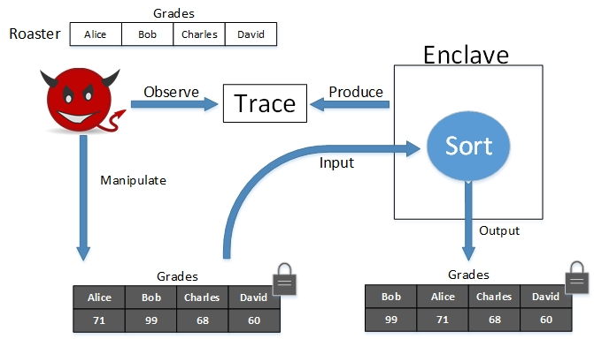

Module 2: Side-channel Vulnerability and Protection
---

#### Preparation

1. C/C++ programming
2. Linux shell and text editing (e.g. vim or emacs)
3. SGX SDK
4. Sorting Algorithms 
 
#### SGX Emulator (1)

1. Install VirtualBox on your local OS.
2. Download the prebuilt VirtualBox image: [[Google Drive](https://goo.gl/3wLLic)]. The login username and password are both `sgx`.
    - Note our emulator currently only supports the setting of *64-bit `Ubuntu 14.04.3 LTS` guest OS in VirtualBox*.
    - Make sure the right Linux version by `uname -r`: `3.19.0-25-generic`
3. Load the emulator
```bash
sudo insmod ~/sgx-emulator/sgx.ko
lsmod | grep sgx #help you check whether module insert successfully
```
4. Run sample code
```bash
cd ~/sgx-emulator
make #compile user code
make r #run user code
```
5. Unload the emulator
```bash
sudo rmmod sgx
```

#### Download Lab2

You can try to use shell command to clone lab repository from GitHub.
```bash
git clone https://github.com/syracuse-fullstacksecurity/CIS700-sgxlab.git
```
or you may go to [https://github.com/syracuse-fullstacksecurity/CIS700-sgxlab](https://github.com/syracuse-fullstacksecurity/CIS700-sgxlab), and download the repository.

After you downloaded the lab2 folder, you can start to finish lab tasks. Each time before compiling your code, you need to **load the emulator first**. Load procedure mentioned above, _3. Load the emulator_ .

When you confirm emulator loaded, you can use command below to compile and run your code.
```bash
cd [your lab directory] #you need to navigate to the lab folder
make #compile client code
make r #run client code
```

#### In-class Lab (2): Leakage of Sorting Algorithms

In a computation, data obliviousness means the data access from the computation is the same no matter what values the input data takes.
This lab is for you students to understand the data obliviousness of common sorting algorithms, including bubble sort, merge sort, etc. This data-dependency will further make the side-channel attack possible in the enclave computation.

To be specific, this lab requires you to complete some sorting algorithms on an array, and observe the data access trace in array indices, and more importantly, whether the trace differs when input array changes (that is, obliviousness). 
For your convinience, index accessing trace will be automatically printed out when you try to use a Class called `TrackedList`. You can use the class as the similar usage with array. For example,

```C++
TrackedList list;
list[0] = 3;
list[1] = list[2];
// Indices trace will be printed out
// (0)(2)(1)


TrackedList * lptr;
(*lptr)[0] = 0;
(*lptr)[2] = (*lptr)[1];
// Indices trace will be printed out
// (0)(1)(2)
```

##### Obliviousness in bubble sort/merge sort

1. Task 1: implement a merge sort in the stub function `mergeSort()` (in file `src/msort.cpp`).
    - Observe the printed access trace, which is interpreted below:
        - The number inside the parenthesis is the index of an array access, and the number outside is the element value of the access. For instance, `(8) 5 (2) 3` are two accesses, with the first on array index  `8` of value `5` and second on array index `2` of avalue `3`.
    - Observe whether the access trace changes when you feed different inputs.
    - For simplicity, you only need to consider the case of 8 element array in all tasks of this lab.

2. Task 2: implement a bubble sort in the stub function `bubbleSort()` (in file `src/bsort.cpp`).
    - Observe the printed access trace
    - Observe whether the access trace changes when you feed different inputs.
     
#### Homework Lab (3): Other algorithms
 
In the in-class exericise, we observe the data obliviousness of merge/bubble sort. In this homework, we try to extend the understanding from obliviousness to side-channel attacks.

To make things concrete, let's talk with a "real" scenario. Consider your lecturer uploads your grades to the Amazon cloud to do some computation that requires sorting, say computing the medium or max grade. To protect your privacy (under FERPA), the lecture carefully opts in the "enclave" option in cloud processing, that is, to encrypt all students records and have the plaintext computation only inside the remote enclave. In this setting, an adversary, be it Amazon, can (A1) manipulate the encrypted list of student grades and (A2) may know the roaster (student names). The advesary also has the capability of (A3) monitoring the data-access trace from the in-enclave sorting computation. 




3. Task 3: Follow up on Task 1, 2.
    - If you get to see different traces of your merge-sort (Task 1), think of an "attack" solution that one can extract secret from the trace.
    - If you get to see different traces of your bubble-sort (Task 2), think of a "protection" solution by revising your implementation so that the traces under different inputs are the same.
4. In Task 4, choose one of the two algorithms to implement (randomized quick sort or edit distance), and observe the access trace.
    - Observe the printed access trace
    - Observe whether the access trace changes when you feed different inputs.
    * [Bonus] Describe if your implementation produces data-dependent (or oblivious) traces. If yes, 
        - [A] think of an "attack" solution that one can extract secret from the trace.
        - [B] think of a "protection" solution to make the trace data-independent. 

